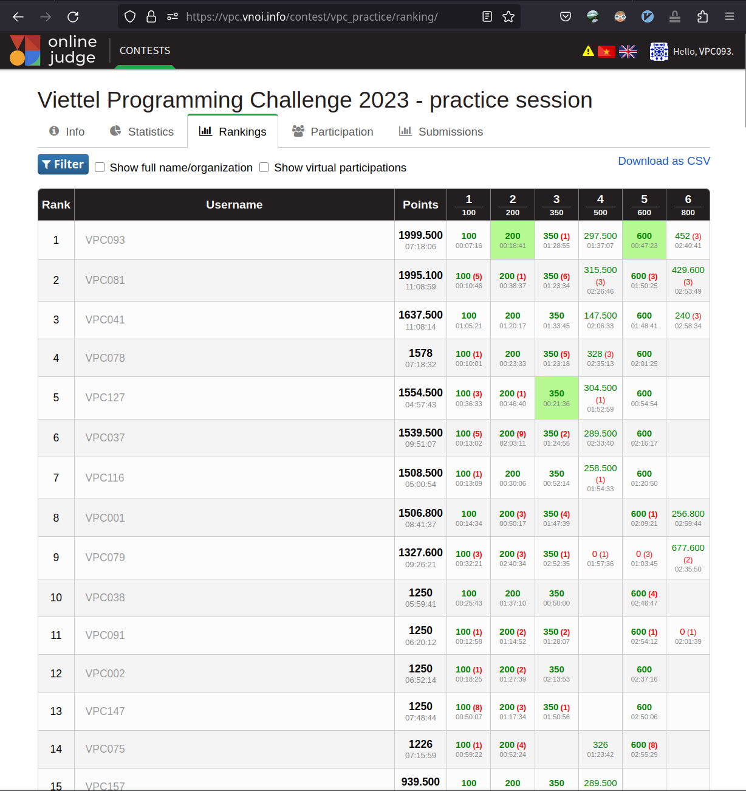

# Viettel Programming Contest 2023 (Practice session)

-----

## Bài A. Chia Cam
### Đề bài
Cho `n` trái cam, kiểm tra xem có thể chia n trái cam thành nhiều phần (>=2) mà mỗi phần lại có thể chia thành 2 phần bằng nhau.

### Lời giải
2 điều kiện trên tương đương: n phải là tổng của >= 2 số nguyên dương chẵn.

=> Kiểm tra:
- n lẻ => NO
- n chẵn
  - Nếu n = 2 => NO
  - n >= 4 => YES 

### Solution: [A's solution](src/A_CAM.java)

## Bài B. Ôn tập
### Đề bài
Có `d` ngày, mỗi ngày An có thể ôn tập từ `l[i]` tới `h[i]` bài (`1` <= `i` <= `d`). 
An cần ôn tập đúng `s` bài trong `d` ngày này.

Câu hỏi: Có thể không? Nếu có in ra 1 cách ôn tập của An.

### Lời giải
Chiến thuật tham lam.
- s cần nằm trong khoảng khả dĩ: lừoi nhất (mỗi ngày ôn tập đúng l[i] bài), và khoảng chăm nhất (ôn tập đúng h[i] bài)
- Nếu s không nằm trong khoảng đó, đương nhiên là không thể.
- Nếu s nằm trong khoảng khả dĩ , thì những ngày đầu tiên An học càng nhiều càng tốt, những ngày còn lại học đúng l[i] bài. 

### Solution: [B's solution](src/B_ONTAP.java)

## Bài C. LICS
Cho 2 dãy số nguyên a, b gồm n, m phần tử. n, m <= 100.
Tìm độ dài lớn nhất của dãy con chung của dãy a,b, mà dãy này là dãy tăng nghiêm ngặt.

### Lời giải
Quy hoạch động.

### Solution: [C's solution](src/C_LIC.java)

## Bài D. Khôi phục cây
### Đề bài
Cho 1 cây có `n` đỉnh. An chỉ nhớ số đỉnh kề với đỉnh 1 là `k`, và nhớ chắc chắn không tồn tại liên kết của `m` cặp đỉnh u_i, v_i
(thật siêu phàm).
`n, m <= 10^5`

Hỏi: Dựa theo trí nhớ của An thì có tồn tại 1 cây nào như vậy không?

### Lời giải (59.5%)
Bài này trong lúc thi team chưa có lời giải trọn vẹn. Lời giải lúc submit và đúng 59.5% như sau:
- Tạo mạng deg[i] là bậc đỉnh tối đa của i (1 <= i <= n). Rõ ràng deg[i] <= n-1 (vì kề tối đa n-1 đỉnh khác)
- Với mỗi cặp u, v mà An nhớ không tồn tại liên kết, ta giảm deg[u] và deg[v] đi 1, vì rõ ràng u không thể kề với v, và ngược lại.
- Kiểm tra deg[1] >= k và deg[i] >= 0 với 2 <= i <= n. Nếu không thì in NO, có thì in YES.

### Solution: [D's solution](src/D_TREE.java)

## Bài E. Vận chuyển
### Đề bài
Có n vị trí, k cửa hàng (mỗi kho là 1 trong n vị trí này). 
Có m con đường (2 chiều) biểu diễn khoảng cách giữa 2 vị trí.
Shipper đang ở vị trí x, một ngừoi khách ở vị trí y đặt hàng. Shipper cần tới 1 cửa hàng nào đó lấy đồ và ship tới y.
Hỏi: khoảng cách ngắn nhất mà shipper cần đi.

### Lời giải
Dễ thấy d(x, y) = min(d(x, s) + d(s, y)) với s thuộc 1 trong k cửa hàng, d(u,v) là khoảng cách ngắn nhất giữa u và v.

Do x, y cho trước, ta cần biết khoảng cách ngắn nhất từ x tới từng cửa hàng, và từ y tới từng cửa hàng.

Sử dụng DIJKTRA để tìm đường đi ngắn nhất từ x tới tất cả đỉnh khác, và từ y tới tất cả đỉnh khác trong đồ thị.
Lúc này, để tìm kết quả ta chỉ việc for trên tập k cửa hàng.

### Solution: [E's solution](src/E_VC.java)

## Bài F. MBAGS

### Đề bài
Có n thỏi vàng, mỗi thỏi có khối lượng a_i (`1 <= i <= n`), và m cái túi sức chứa giống nhau và bằng M.
Tìm M nhỏ nhất để chứa được hết số vàng trên. Và in ra mỗi túi đựng thỏi vàng nào.

Có 10 test, 30% test trong đó n <= 20, 70% test n lớn cỡ 200, 400 (không nhớ rõ)
Sự chênh lệch giữa kết quả của tác giả và kết quả của thí sinh sẽ là căn cứ tính điểm.

### Lời giải
Bài này có thể có chiến lược dùng quy hoạch động, biểu diễn trạng thái qua binary với n <= 20.
Tuy nhiên lúc thi thì không có nhiều tỉnh táo để giải quyết trọn vẹn case n <= 20.
Cách làm lúc thi là 1 chiến lược tham lam như sau:
- Sắp xếp a_i theo thứ tự tăng dần về khối lượng
- Bỏ lần lượt a_i vào các túi theo thứ tự: 1,2,3,...m, tiếp sau đó bỏ lại vào m, m-1, ..., 3, 2, 1.
  (Bỏ đan xen để lúc đầu túi 1 đựng nặng trong mẻ m thỏi, sau đó mẻ m thỏi sau bỏ nhẹ hơn).

Chiến lược này giúp đạt: `452 / 800` điểm, giúp team `VPC093` (ThucDX, HungND61, TrangNM12) giành vị trí `#1` ở Practice session của VPC 2023 (Chỉ hơn đội theo sau 4.4 điểm.)

https://vpc.vnoi.info/contest/vpc_practice/ranking/

(Code không post ở đây)

Good luck and happy coding!

